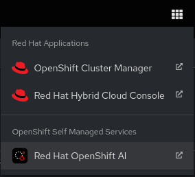
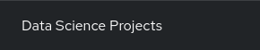
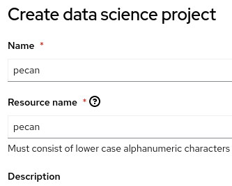

# PEcAn Unconstrained Ecological Forecast Course

## Written by [Christopher Tate](https://www.computate.org/)

- Red Hat Principal Software Engineer in Red Hat Research 

- Creator of the Smart Village Operator and Smart Village Platform 

- Architect of the Red Hat Social Innovation Program 

- Founder of the Smarta Byar Smart Village Community FIWARE Innovation Hub 

- Principal Software Engineer for the New England Research Cloud

## OpenShift cluster prerequisites

### Clone the pecan-unconstrained-forecast-course

Create a source directory for the pecan-unconstrained-forecast-course 
and clone the pecan-unconstrained-forecast-course with git. 

```bash
mkdir -p ~/.local/src/pecan-unconstrained-forecast-course
git clone https://github.com/computate-org/pecan-unconstrained-forecast-course.git ~/.local/src/pecan-unconstrained-forecast-course
```

### Deploy the OpenShift AI Operator

As a cluster admin, deploy the OpenShift AI Operator 
and Wait for the OpenShift AI Operator to be installed. 

```bash
oc apply -k ~/.local/src/pecan-unconstrained-forecast-course/kustomize/bundles/openshift-ai/base/

oc -n redhat-ods-operator wait csv -l operators.coreos.com/rhods-operator.redhat-ods-operator="" --for=jsonpath={.status.phase}='Succeeded'
```

As a cluster admin, deploy the required Role Bindings in the pecan namespace to run the containers. 

```bash
oc apply -k ~/.local/src/pecan-unconstrained-forecast-course/kustomize/bundles/pecan/base/
```

### Deploy a Data Science Cluster

Deploy a Data Science Cluster and wait for it to be ready. 

```bash
oc apply -k ~/.local/src/pecan-unconstrained-forecast-course/kustomize/bundles/openshift-ai/app/datascienceclusters/

oc -n redhat-ods-operator wait datasciencecluster/default-dsc --for=jsonpath='{.status.phase}'='Ready'
```

### Deploy R Studio and PEcAn Unconstrained Forecast Image Streams

Deploy the R Studio and PEcAn Unconstrained Forecast Image Streams to OpenShift AI. 

```bash
oc apply -k ~/.local/src/pecan-unconstrained-forecast-course/kustomize/bundles/openshift-ai/app/imagestreams/
```

### Create a PEcAn Data Science Project in OpenShift AI

- In the OpenShift Console, open the OpenShift AI app. 

 

- Click on 

- Click on 

- Create a Data Science Project named: `pecan`



- Click on 

- Click on 

- Create a workbench named: `pecan-unconstrained-forecast`

- With image selection: `PEcAn Unconstrained Forecast`

- Click on 

- The workbench will say `Starting...` for a few minutes. 
Wait for the workbench to say `Ready`. 

- Click on 

### Grant default service account edit role in namespace

To grant the default service account edit role privileges, you will use
either your own terminal where you have logged in to OpenShift, or use
the built-in OpenShift Terminal. We will grant edit privileges on the
default service account, as well as edit privileges on roles and
rolebindings in the namespace so that the default service account can
deploy resources in your namespace.

```
oc create rolebinding pecan-unconstrained-forecast-edit --clusterrole=edit \
  --serviceaccount=$(oc get project -o \
  jsonpath={.items[0].metadata.name}):pecan-unconstrained-forecast

oc create role pecan-unconstrained-forecast-edit-rolebindings \
  --verb=get,list,watch,create,update,patch,delete \
  --resource=roles,rolebindings

oc create rolebinding pecan-unconstrained-forecast-edit-rolebindings --role=pecan-unconstrained-forecast-edit-rolebindings \
  --serviceaccount=$(oc get project -o jsonpath={.items[0].metadata.name}):pecan-unconstrained-forecast
```

## RSync the forecast_example directory to the pod

Ask the professor for a link to the forecast_example.tgz, 
then rsync the forecast_example to the pod: 

```bash
mkdir ~/Downloads/forecast_example/

mv ~/Downloads/forecast_example.tgz ~/Downloads/forecast_example/

oc -n pecan rsync ~/Downloads/forecast_example/ pecan-unconstrained-forecast-0:/opt/app-root/src/forecast_example/
```

### Clone the pecan-unconstrained-forecast-course in your OpenShift AI Workbench

Return to your OpenShift AI Workbench and clone the pecan-unconstrained-forecast-course with git into the home directory of your new OpenShift AI Workbench. 

```bash
git clone https://github.com/computate-org/pecan-unconstrained-forecast-course.git ~/pecan-unconstrained-forecast-course
```

Open up the first course

