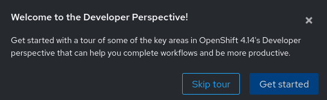
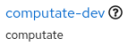
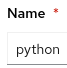

# PEcAn Unconstrained Ecological Forecast Course

## Written by [Christopher Tate](https://www.computate.org/)

- Red Hat Principal Software Engineer in Red Hat Research 
- Creator of the Smart Village Operator and Smart Village Platform 
- Architect of the Red Hat Social Innovation Program 
- Founder of the Smarta Byar Smart Village Community FIWARE Innovation Hub 
- Principal Software Engineer for the New England Research Cloud

# Red Hat OpenShift Developer Sandbox

This is a course showing you how to try out the PEcAn Ecological Forecasting platform for free in the Red Hat OpenShift Developer Sandbox. 

## How to start an OpenShift Developer Sandbox

Start a [free Red Hat OpenShift Developer Sandbox
here](https://developers.redhat.com/developer-sandbox).


Click on the

button in the top right corner.


### Register for a free Red Hat account

If you do not already have a free Red Hat account, click
.

Log in if you already have a free Red Hat account:


### Start your OpenShift Developer Sandbox

After you are logged into your Red Hat account, return to the page to
start a [free Red Hat OpenShift Developer Sandbox
here](https://developers.redhat.com/developer-sandbox).

Click


Then click


Before you can access your new sandbox, you will need to request an
activation code by phone. Click on the link.

Be sure to enter your country code, and phone number correctly, then
check your phone for the activation code.


Enter your activation code in the box .

After a few moments, you should be able to start your Red Hat OpenShift
Developer Sandbox. Click the button to start your sandbox for free.


If you see a message
,
then click


You can get started in the Red Hat OpenShift platform by clicking on the
button.


Log in by clicking on the

button to log into the new sandbox with your Red Hat account.

Explore your new sandbox with a tour, or get started now.



## Using the OpenShift Developer Sandbox

### Download the oc command
- Click the

button in the top right of the Developer Sandbox.

- Click
.
- Click the download link for your operating system.


- You'll need to extract the `oc` command and place it in your path,
for example in a `bin` directory in your `$HOME` directory.

```bash
mkdir -p ~/bin
tar xvf ~/Downloads/oc.tar -C ~/bin/
```

### Log into the OpenShift CLI in your terminal


- Click your username in the top right corner of the Developer Sandbox.
- Click
.
- Click
.
- Click
.
- Copy the line to the clipboard that looks like this:


- Paste the command into your terminal to log in to the Developer Sandbox in the terminal.


### Try the built-in OpenShift Command Line Terminal

If you would rather use the built-in OpenShift Command Line Terminal,
you can click the

button at the top.

Start your terminal with the

button.


### Grant default service account edit role in namespace

To grant the default service account edit role privileges, you will use
either your own terminal where you have logged in to OpenShift, or use
the built-in OpenShift Terminal. We will grant edit privileges on the
default service account, as well as edit privileges on roles and
rolebindings in the namespace so that the default service account can
deploy resources in your namespace.

```
oc create rolebinding python-edit --clusterrole=edit \
  --serviceaccount=$(oc get project -o \
  jsonpath={.items[0].metadata.name}):python

oc create role python-edit-rolebindings \
  --verb=get,list,watch,create,update,patch,delete \
  --resource=roles,rolebindings

oc create rolebinding python-edit-rolebindings --role=python-edit-rolebindings \
  --serviceaccount=$(cat /var/run/secrets/kubernetes.io/serviceaccount/namespace):python
```

# OpenShift AI

## Set up an OpenShift AI Workbench

### Accessing OpenShift AI

In your OpenShift Sandbox, click on the apps button

at the top,

then click

to log into OpenShift AI.

Click the button to
.

Log into OpenShift AI by clicking on the

button.

Once you are in OpenShift AI, click on the menu button
,
then click
.

Then click on the name of your data science project
,
for my Red Hat user it’s computate-dev.

### Create a new OpenShift AI Workbench

To create a new workbench, click
.

To stay consistent with the rest of the course, enter the workbench name
“python”
.

For Image selection, choose “Minimal Python”
.

You can leave the rest of the fields as the default. At the very bottom,
click
.

After a minute or two, you should see the workbench change from

to
.

### Access your OpenShift AI Workbench

In OpenShift AI, click on the

link to open your new OpenShift AI Workbench.

Log into OpenShift AI by clicking on the

button.

You will need to authorize yourself access to your workbench. Click
.

## Using an OpenShift AI Python Workbench

### Using a Workbench Terminal to load course resources

You will want to open a Terminal inside your OpenShift AI Workbench to
load the course resources. There are many ways to open a terminal, but
here is one that always works.

At the top, click

→

→
.

### Clone the pecan-unconstrained-forecast-course course

With git, clone the course materials to the default home directory
(/opt/app-root/src) of your workbench.

```bash
git clone https://github.com/computate-org/pecan-unconstrained-forecast-course.git ~/pecan-unconstrained-forecast-course
```

### Open the course Jupyter Notebook

A Jupyter Notebook is an interactive, online notebook, and the rest of
the course be found in the Jupter Notebooks. 

## Next...
If you have successfully ran all of the commands above, congratulations, you are ready to move on to the next notebook in the course. 
- In your workbench, make sure your left sidebar is open. If it’s not,
press \[ Ctrl \] + \[ b \].
- Navigate to `pecan-unconstrained-forecast-course`. 
- Open the first Notebook [01-ecological-forecasting-in-the-cloud.ipynb](01-ecological-forecasting-in-the-cloud.ipynb) and follow the instructions from there. 

- If you have additional questions or issues, please [create an issue for the course here](https://github.com/computate-org/pecan-unconstrained-forecast-course/issues). 