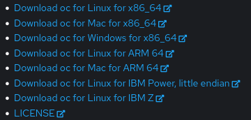
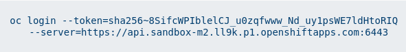
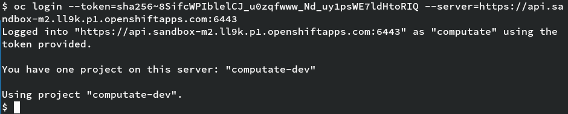
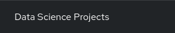
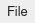

# R Shiny demo on NERC

[](../rshiny-app-eco-forecast-sites.png)

R Shiny is package that makes it easy to build interactive web apps straight from R & Python, [see the Shiny website](https://shiny.posit.co/). 

See how we can develop a Shiny application directly in our NERC OpenShift AI project workbench to map ecological forecasting sites in a PostgreSQL database. We will run the Shiny app and make it available ata new route in the browser. 

## Using the OpenShift Environment

Log into the OpenShift Console here [https://console.apps.shift.nerc.mghpcc.org](https://console.apps.shift.nerc.mghpcc.org). 

### Download the oc command
- Click the

button in the top right of OpenShift container.

- Click
.

- Click the download link for your operating system.



- You'll need to extract the `oc` command and place it in your path,
for example in a `bin` directory in your `$HOME` directory.

```bash
mkdir -p ~/.local/bin
tar xvf ~/Downloads/oc.tar -C ~/.local/bin/
```

### Log into the OpenShift CLI in your terminal

- Click your username in the top right corner of OpenShift.

- Click
.

- Log into NERC with the right provider and user. 

- Click
.

- Copy the line to the clipboard that looks like this:



- Paste the command into your terminal to log in to OpenShift in the terminal.



### Create a PEcAn Data Science Project in OpenShift AI

- In the OpenShift Console, open the OpenShift AI app. 

 

- Click on 

- Select your data science project. If you do not already have a data science project, you will want
  to create a project and allocation for your team in the [NERC Coldfront application](https://coldfront.mss.mghpcc.org). 

- Click on 

- Create a workbench named: `pecan-unconstrained-forecast`

- With image selection: `Datascience + RStudio JupyterLab Notebook image on Centos Stream 9 with Python 3.9` or `PEcAn Unconstrained Forecast`

- Click on 

- The workbench will say `Starting...` for a few minutes. 
Wait for the workbench to say `Ready`. 

- Click on 

### Grant default service account edit role in namespace

To grant the OpenShift AI workbench service account edit role privileges, 
you will use either your own terminal where you have logged in to OpenShift. 
We will grant edit privileges on the
default service account, as well as edit privileges on roles and
rolebindings in the namespace so that the workbench service account can
deploy resources in your namespace.

Run the commands below in your terminal after logging into the CLI above. 

Here we assume that you created an OpenShift AI workbench called `pecan-unconstrained-forecast`. 

```
oc create rolebinding pecan-unconstrained-forecast-edit --clusterrole=edit \
  --serviceaccount=$(oc get project -o \
  jsonpath={.items[0].metadata.name}):pecan-unconstrained-forecast

oc create role pecan-unconstrained-forecast-edit-rolebindings \
  --verb=get,list,watch,create,update,patch,delete \
  --resource=roles,rolebindings

oc create rolebinding pecan-unconstrained-forecast-edit-rolebindings --role=pecan-unconstrained-forecast-edit-rolebindings \
  --serviceaccount=$(oc get project -o jsonpath={.items[0].metadata.name}):pecan-unconstrained-forecast
```

### Using a Workbench Terminal to load course resources

From here, you can continue following the same course in your OpenShift AI Workbench on NERC. 
You will want to open a Terminal inside your OpenShift AI Workbench to
load the course resources. There are many ways to open a terminal, but
here is one that always works.

At the top, click

→

→
.

### Clone the pecan-unconstrained-forecast-course

In the terminal in your workbench, clone the course into your home directory. 

```bash
git clone https://github.com/computate-org/pecan-unconstrained-forecast-course.git ~/pecan-unconstrained-forecast-course
```

## Next...
If you have successfully ran all of the commands above, congratulations, you are ready to move on to the next notebook in the course. 
- If you have additional questions or issues, please [create an issue for the course here](https://github.com/computate-org/pecan-unconstrained-forecast-course/issues). 
- Otherwise, please continue to the next notebook [03-prepare-rshiny-demo.ipynb](../03-prepare-rshiny-demo.ipynb). 
